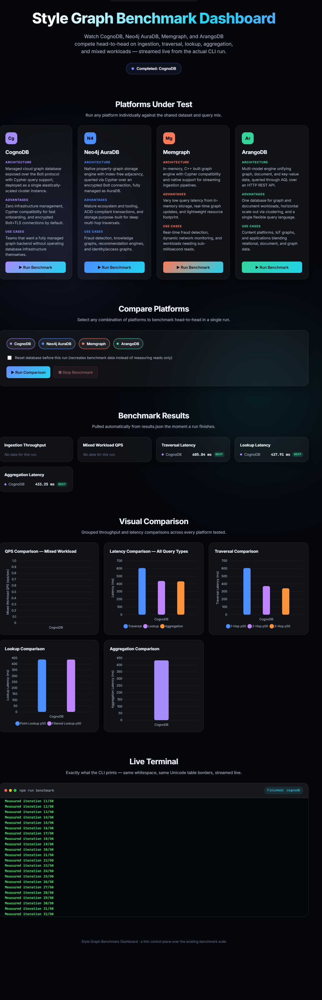
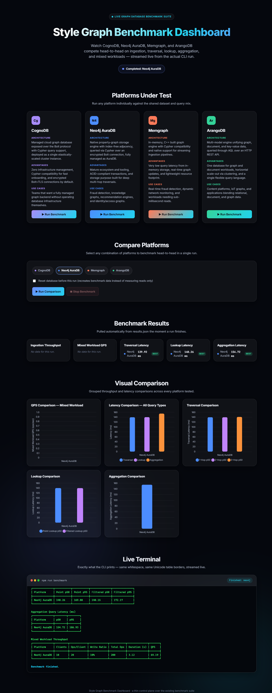
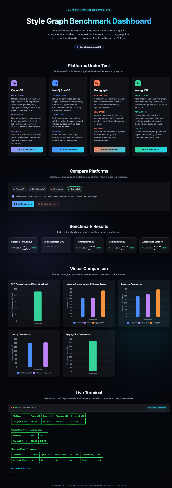
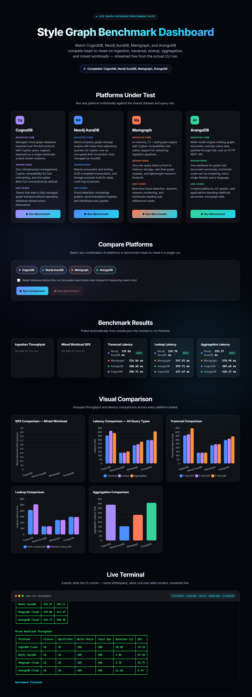
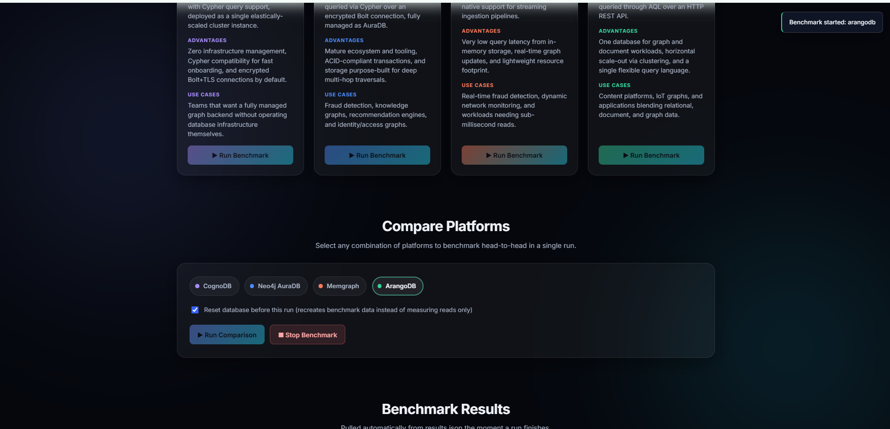
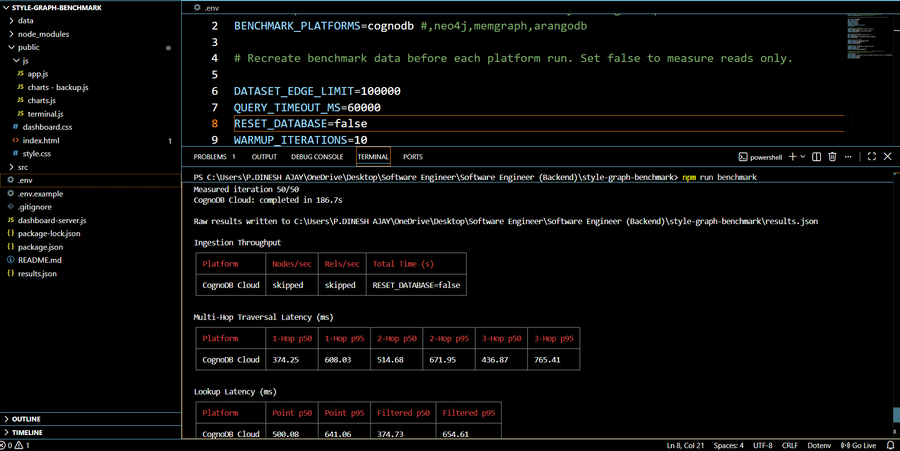

# Style Graph Benchmark

A reproducible graph-database benchmarking and technology-evangelism dashboard for comparing **CognoDB Cloud, Neo4j AuraDB, Memgraph Cloud, and ArangoDB** using a common dataset and benchmark workload.

## Live Demo

🚀 **Live Application:** https://style-graph-benchmark.onrender.com/

The project has two layers:

- **Benchmark engine** — the existing CLI benchmark that performs the real database measurements.
- **Web dashboard** — an Express/HTML/CSS/JavaScript dashboard that launches the benchmark, streams the real CLI output live, reads `results.json`, and visualizes the results.

The dashboard is a control and presentation layer around the benchmark; it does not replace the benchmark engine.

## Features

- Run one graph/database platform independently.
- Compare multiple platforms in one run.
- Use a deterministic benchmark dataset.
- Measure ingestion throughput.
- Measure 1-hop, 2-hop, and 3-hop traversal latency.
- Measure point and filtered lookup latency.
- Measure aggregation latency.
- Measure mixed-workload throughput/QPS.
- Report p50 and p95 latency.
- Configure warm-up iterations.
- Optionally reset benchmark data before a run.
- Stream the actual CLI stdout/stderr to the browser.
- Preserve terminal formatting and Unicode table output.
- Generate/read structured `results.json` output.
- Display result cards and Chart.js visualizations.
- Keep `npm run benchmark` independently usable.
- Prevent concurrent dashboard benchmark runs.
- Support Windows process execution.

## Supported Platforms

| Platform | Benchmark Key | Query / Connection Model |
|---|---|---|
| CognoDB Cloud | `cognodb` | Cypher / Bolt-compatible connection |
| Neo4j AuraDB | `neo4j` | Cypher / Bolt |
| Memgraph Cloud | `memgraph` | Cypher / Bolt |
| ArangoDB Cloud | `arangodb` | AQL / HTTP |

## Architecture

```text
                         +--------------------------+
                         |        Web Browser       |
                         | Dashboard / Charts       |
                         | Controls / Live Terminal |
                         +------------+-------------+
                                      |
                                  HTTP / SSE
                                      |
                                      v
                         +--------------------------+
                         |   dashboard-server.js    |
                         | Express + Benchmark API  |
                         | SSE Terminal Stream       |
                         +------------+-------------+
                                      |
                              child_process.spawn()
                                      |
                                      v
                         +--------------------------+
                         |     npm run benchmark    |
                         |      Benchmark Engine    |
                         +------------+-------------+
                                      |
                                      v
                 +-------------------------------------------+
                 | Dataset | Platform Adapters | Metrics     |
                 | Queries | Throughput       | results.json |
                 +-------------------------------------------+
```

### Separation of concerns

The benchmark engine handles database connections, dataset preparation, queries, measurements, CLI output, and `results.json`.

The dashboard handles platform selection, benchmark launching/stopping, process-level environment overrides, live output streaming, results loading, and visualization.

## Project Structure

```text
style-graph-benchmark/
│
├── data/
├── src/
│
├── public/
│   ├── index.html
│   ├── style.css
│   └── js/
│       ├── app.js
│       ├── charts.js
│       └── terminal.js
│
├── docs/
│   └── screenshots/
│       ├── dashboard-cognodb-individual.png
│       ├── dashboard-neo4j-individual.png
│       ├── dashboard-arangodb-individual-reset.png
│       ├── dashboard-four-platform-comparison.png
│       ├── dashboard-compare-platforms-reset.png
│       └── cli-cognodb-benchmark-results.png
│
├── dashboard-server.js
├── package.json
├── .env.example
├── results.json
└── README.md
```

## Requirements

- Node.js
- npm
- Network access to the configured databases
- Valid credentials for the selected platforms

Check versions:

```bash
node --version
npm --version
```

## Installation

```bash
git clone <YOUR_REPOSITORY_URL>
cd style-graph-benchmark
npm install
```

## Environment Configuration

Create `.env` in the project root.

Example:

```env
BENCHMARK_PLATFORMS=cognodb
DATASET_EDGE_LIMIT=100000
QUERY_TIMEOUT_MS=60000
RESET_DATABASE=false
WARMUP_ITERATIONS=10
```

Configure the required database connection variables used by the platform adapters. Never commit real credentials.

A safe `.env.example` can contain:

```env
BENCHMARK_PLATFORMS=cognodb,neo4j,memgraph,arangodb
DATASET_EDGE_LIMIT=100000
QUERY_TIMEOUT_MS=60000
RESET_DATABASE=false
WARMUP_ITERATIONS=10

# Add platform connection variables here.
# Do not put real passwords or tokens in this file.
```

## Configuration

### BENCHMARK_PLATFORMS

One platform:

```env
BENCHMARK_PLATFORMS=cognodb
```

Multiple platforms:

```env
BENCHMARK_PLATFORMS=cognodb,neo4j,memgraph,arangodb
```

### DATASET_EDGE_LIMIT

Controls the maximum number of relationships used by the benchmark.

```env
DATASET_EDGE_LIMIT=100000
```

The demonstrated configuration uses 100,000 relationships.

### QUERY_TIMEOUT_MS

```env
QUERY_TIMEOUT_MS=60000
```

### RESET_DATABASE

Reuse existing benchmark data:

```env
RESET_DATABASE=false
```

Recreate benchmark data before a run:

```env
RESET_DATABASE=true
```

### WARMUP_ITERATIONS

```env
WARMUP_ITERATIONS=10
```

## Dataset

The benchmark uses a deterministic graph dataset derived from the `soc-Epinions1` social-network dataset. The demonstrated configuration uses an edge limit of 100,000.

The benchmark output can show approximately 11,208 nodes and 100,000 relationships depending on the current dataset preparation.

The important requirement is that the same logical dataset is used for the selected platforms.

## Deterministic Workload Parameters

The benchmark generates deterministic parameter sets for its workload queries. The demonstrated benchmark output reports:

```text
Generated 200 deterministic parameter sets
```

Deterministic parameters reduce variation caused by randomly changing query inputs.

## Benchmark Workloads

### 1. Ingestion Throughput

Measures graph-data ingestion performance.

Typical output:

```text
Platform       Nodes/sec       Rels/sec       Total Time (s)
------------------------------------------------------------
CognoDB        ...             ...            ...
Neo4j          ...             ...            ...
Memgraph       ...             ...            ...
ArangoDB       ...             ...            ...
```

When `RESET_DATABASE=false`, ingestion may be skipped because existing benchmark data is reused.

### 2. Multi-Hop Traversal

Measures 1-hop, 2-hop, and 3-hop graph traversals.

```text
Platform       1-Hop p50   1-Hop p95   2-Hop p50   2-Hop p95   3-Hop p50   3-Hop p95
---------------------------------------------------------------------------------------
CognoDB        ...         ...         ...         ...         ...         ...
Neo4j          ...         ...         ...         ...         ...         ...
Memgraph       ...         ...         ...         ...         ...         ...
ArangoDB       ...         ...         ...         ...         ...         ...
```

### 3. Point Lookup

Measures retrieval by a direct identifier using point p50/p95 latency.

### 4. Filtered Lookup

Measures lookup queries with additional filtering using filtered p50/p95 latency.

### 5. Aggregation

Measures aggregation-query latency using p50/p95 values.

### 6. Mixed Workload

The demonstrated mixed workload uses:

```text
Clients:       10
Ops/Client:    20
Write Ratio:   10%
Total Ops:     200
```

The benchmark reports duration and QPS. Actual values depend on the platform and run.

## Latency Metrics

### p50

p50 is the median measured latency and represents typical observed performance.

### p95

p95 represents tail latency. Approximately 95% of measured operations complete at or below this value.

Example:

```text
p50 = 140 ms
p95 = 180 ms
```

## Throughput Metrics

QPS means operations/queries per second for the configured mixed workload.

A simplified calculation is:

```text
QPS = completed operations / execution time
```

QPS must be interpreted together with clients, operations per client, read/write ratio, dataset size, database configuration, and network conditions.

## Warm-up and Measurement

The benchmark performs warm-up iterations before measured iterations. The demonstrated configuration uses 10 warm-up iterations.

Example:

```text
Warmup 1/10
Warmup 2/10
...
Warmup 10/10
Measured iteration 1/50
Measured iteration 2/50
...
Measured iteration 50/50
```

Warm-up helps reduce the influence of initial connection, cache, and query-preparation effects.

## Reset Database Mode

The dashboard exposes a `Reset database before this run` option.

With reset disabled:

```env
RESET_DATABASE=false
```

existing benchmark data can be reused.

With reset enabled:

```env
RESET_DATABASE=true
```

the benchmark recreates benchmark data before measuring the selected platform.

## CLI Usage

The original benchmark remains independently executable:

```bash
npm run benchmark
```

The command executes the benchmark engine and generates human-readable CLI output and, when successful, structured `results.json` output.

## Dashboard Usage

Start the dashboard:

```bash
node dashboard-server.js
```

Open:

```text
http://localhost:3000
```

## Dashboard Sections

```text
Style Graph Benchmark Dashboard
|
+-- Platforms Under Test
+-- Compare Platforms
+-- Benchmark Results
+-- Visual Comparison
+-- Live Terminal
```

## Platforms Under Test

Each platform is presented as a dashboard card containing its name, description, advantages/use cases, and a benchmark control.

Each platform can be run independently.

## Individual Benchmark

For example, selecting CognoDB sends the equivalent of:

```text
BENCHMARK_PLATFORMS=cognodb
```

The dashboard then starts the real benchmark, streams its output, waits for completion, reads `results.json`, and updates the UI.

## Compare Platforms

Users can select any supported combination.

Example request:

```json
{
  "platforms": [
    "cognodb",
    "neo4j",
    "memgraph",
    "arangodb"
  ],
  "reset": false
}
```

## Dashboard API

### GET `/api/status`

Returns benchmark state.

Example:

```json
{
  "running": false,
  "platforms": []
}
```

### POST `/api/run`

Starts a benchmark.

Example:

```json
{
  "platforms": ["neo4j"],
  "reset": false
}
```

### GET `/api/results`

Returns the current structured benchmark results from `results.json`.

### POST `/api/stop`

Requests termination of the currently running benchmark.

### GET `/api/terminal`

Provides the Server-Sent Events stream used by the browser for live benchmark output.

## Live Terminal

The dashboard displays the actual CLI output rather than a simulated progress bar.

Example:

```text
Warmup 1/10
Warmup 2/10
...
Measured iteration 1/50
Measured iteration 2/50
...
Benchmark finished
```

The server streams stdout and stderr to the browser, allowing users to see the benchmark while it is running.

## Server-Sent Events

The flow is:

```text
Benchmark Process
      |
      | stdout / stderr
      v
Dashboard Server
      |
      | SSE
      v
Browser
      |
      v
Live Terminal
```

SSE is appropriate because benchmark output primarily flows from the server to the browser.

## Results

The benchmark writes:

```text
results.json
```

The dashboard reads this file after a run and uses the structured data to populate cards and charts.

```text
CLI output   -> human-readable execution information
results.json -> machine-readable benchmark results
Dashboard    -> visual representation
```

## Visualizations

The dashboard uses Chart.js for visual comparison.

Typical charts include:

- mixed-workload QPS comparison
- latency comparison
- traversal comparison
- lookup comparison
- aggregation comparison

## Screenshots

The following screenshots show the Style Graph Benchmark dashboard and the actual benchmark execution workflow.

> **GitHub setup:** Place these image files inside `docs/screenshots/` using the exact filenames shown below. The relative Markdown paths below will then render the screenshots automatically when this README is viewed on GitHub.

### 1. CognoDB — Individual Benchmark

This screenshot shows an individual CognoDB benchmark run, including the platform selection, benchmark results, visual comparison charts, and live terminal output.



---

### 2. Neo4j AuraDB — Individual Benchmark

This screenshot shows an individual Neo4j AuraDB benchmark run and its measured latency results, charts, and live terminal output.



---

### 3. ArangoDB — Individual Benchmark with Database Reset

This screenshot shows an ArangoDB benchmark run with the database reset option enabled. It demonstrates ingestion throughput, latency measurements, visual comparisons, and the live terminal results.



---

### 4. Four-Platform Comparison

This screenshot shows the head-to-head comparison of all four supported platforms:

- CognoDB
- Neo4j AuraDB
- Memgraph
- ArangoDB

It demonstrates the combined benchmark results and visual comparison charts.



---

### 5. Compare Platforms — Reset Database

This screenshot shows the **Compare Platforms** section with the database-reset option enabled before running a comparison.



---

### 6. CognoDB — CLI Benchmark Results

This screenshot shows the original benchmark running directly from the VS Code terminal using `npm run benchmark`. It demonstrates that the benchmark engine works independently of the web dashboard and produces actual benchmark output.



---

## Screenshot Directory

The screenshots used by this README should be stored exactly as follows:

```text
style-graph-benchmark/
│
├── docs/
│   └── screenshots/
│       ├── dashboard-cognodb-individual.png
│       ├── dashboard-neo4j-individual.png
│       ├── dashboard-arangodb-individual-reset.png
│       ├── dashboard-four-platform-comparison.png
│       ├── dashboard-compare-platforms-reset.png
│       └── cli-cognodb-benchmark-results.png
│
├── data/
├── src/
├── public/
├── dashboard-server.js
├── package.json
├── .env.example
├── results.json
└── README.md
```

### Screenshot filenames

| Screenshot | Exact filename |
|---|---|
| CognoDB individual dashboard | `dashboard-cognodb-individual.png` |
| Neo4j individual dashboard | `dashboard-neo4j-individual.png` |
| ArangoDB individual reset dashboard | `dashboard-arangodb-individual-reset.png` |
| Four-platform comparison | `dashboard-four-platform-comparison.png` |
| Compare Platforms reset | `dashboard-compare-platforms-reset.png` |
| CognoDB CLI benchmark results | `cli-cognodb-benchmark-results.png` |

### Why the images render on GitHub

The README uses relative paths such as:

```markdown

```

Because the README is in the repository root and the screenshots are inside `docs/screenshots/`, GitHub resolves the path relative to the README and displays the image.

Make sure the **filename and capitalization are exactly the same** as the files committed to GitHub.

---

## Example Observed Run

One captured four-platform dashboard run displayed approximately:

| Platform | Traversal Latency | Lookup Latency | Aggregation Latency |
|---|---:|---:|---:|
| Neo4j AuraDB | 139.86 ms | 139.78 ms | 155.37 ms |
| Memgraph | 234.56 ms | 247.51 ms | 278.98 ms |
| ArangoDB | 300.60 ms | 299.71 ms | 410.17 ms |
| CognoDB | 358.71 ms | 417.67 ms | 389.68 ms |

The same captured run displayed approximately:

| Platform | Mixed Workload QPS |
|---|---:|
| CognoDB | 19.23 |
| Neo4j AuraDB | 67.94 |
| Memgraph | 34.77 |
| ArangoDB | 9.34 |

These are observations from one captured execution, not permanent performance specifications. Run the benchmark again for current measurements.

## Fairness and Interpretation

The benchmark aims to keep the logical workload consistent through:

- a shared deterministic dataset
- deterministic query parameters
- the same workload categories
- the same warm-up/measurement model
- the same benchmark orchestration

However, the cloud services may use different infrastructure, regions, resource limits, storage engines, query engines, and service configurations.

Therefore, results should be described as **observed performance under the tested configuration and environment**, not as universal database rankings.

## Network Considerations

For cloud databases, measured client latency can include network overhead:

```text
Client -> Network -> Cloud Database -> Network -> Client
```

Therefore client-observed latency is not necessarily equal to database-engine execution time.

For meaningful comparisons, run platforms from the same client environment and, where possible, comparable cloud regions.

## Repeated Runs

A single run should not be treated as a universal performance guarantee.

For stronger analysis, repeat the benchmark and compare:

- p50
- p95
- QPS
- mean
- variance
- consistency

## Windows Compatibility

On Windows, the dashboard should spawn the npm executable using `npm.cmd` where required.

The benchmark should be started as a child process without unnecessary shell execution.

## Concurrency Protection

The dashboard should allow only one benchmark process at a time. This prevents competing workloads, simultaneous `results.json` writes, conflicting terminal streams, and inconsistent UI state.

## Error Handling

Actual database and process errors should be shown in the live terminal.

Possible errors include:

```text
Failed to connect to server
EHOSTUNREACH
ENOTFOUND
ECONNREFUSED
```

The dashboard should not replace an actual failure with a false successful result.

## Troubleshooting

### Dashboard does not start

```bash
node dashboard-server.js
```

Check the console for missing dependencies, syntax errors, environment errors, or port conflicts.

### Port 3000 is already in use

Stop the process using the port or configure the application to use another supported port.

### Database connection fails

Check the endpoint, credentials, database configuration, cloud service status, network, firewall, TLS configuration, and `.env` values.

### `results.json` is missing

Run the benchmark directly:

```bash
npm run benchmark
```

If the CLI benchmark fails, fix that failure before debugging the dashboard.

### Live terminal does not update

Check the browser Network tab for the `/api/terminal` SSE connection and check the dashboard server console.

### Charts do not update

Check `results.json`, `/api/results`, browser console errors, Chart.js loading, `public/js/charts.js`, and the JSON structure returned by the API.

## Security

Never commit real database credentials.

Recommended `.gitignore` entries:

```gitignore
node_modules/
.env
.env.local
.env.*.local
logs/
.DS_Store
```

Decide separately whether `results.json` should be committed. If it contains sensitive information, keep it out of Git.

## Technology Stack

### Backend

- Node.js
- Express.js
- `child_process`
- Server-Sent Events
- dotenv

### Frontend

- HTML5
- CSS3
- JavaScript
- Chart.js

### Benchmarking

- Node.js
- graph/database client drivers
- deterministic dataset generation
- query execution
- latency measurement
- throughput measurement
- JSON result generation

## Main Components

### `dashboard-server.js`

Express wrapper around the existing CLI benchmark. It serves the dashboard, exposes the API, starts/stops benchmark processes, applies process-level environment overrides, streams output, and returns results.

### `public/index.html`

Main dashboard structure.

### `public/js/app.js`

Dashboard interaction and API logic.

### `public/js/charts.js`

Chart.js visualizations.

### `public/js/terminal.js`

SSE connection and live terminal behavior.

### `src/orchestrator.js`

Benchmark orchestration.

### `src/metrics.js`

Benchmark measurement/metric functionality.

### `src/platforms/`

Platform-specific database adapters.

## Recommended Demonstration

1. Start the dashboard.
2. Open `http://localhost:3000`.
3. Explain the four supported platforms.
4. Run one platform individually.
5. Show the live terminal.
6. Show the result cards.
7. Show the charts.
8. Open `Compare Platforms`.
9. Select multiple platforms.
10. Run the comparison.
11. Show the live CLI output.
12. Show the final comparison charts.

This demonstrates that the dashboard is connected to the actual benchmark rather than displaying static numbers.

## Future Improvements

- Store historical benchmark runs.
- Add repeated-run automation.
- Calculate mean, median, standard deviation, and variance.
- Export CSV reports.
- Generate PDF benchmark reports.
- Add historical comparison charts.
- Add configurable dataset sizes.
- Add more graph workloads such as shortest path, recommendation traversal, fraud-detection traversal, graph pattern matching, bulk updates, and relationship operations.

## Project Principle

The core principle of the project is:

```text
The benchmark measures.
The dashboard controls and visualizes.
```

The CLI benchmark remains independently executable, while the dashboard provides a modern interface for controlling and presenting the benchmark.

## Quick Start

```bash
npm install
npm run benchmark
```

For the dashboard:

```bash
node dashboard-server.js
```

Then open:

```text
http://localhost:3000
```

## Summary

**Style Graph Benchmark** is a reproducible graph-database benchmarking suite with a live Express.js dashboard that launches the existing CLI benchmark, streams its real-time output, reads structured results, and provides visual comparison across CognoDB Cloud, Neo4j AuraDB, Memgraph Cloud, and ArangoDB Cloud.
